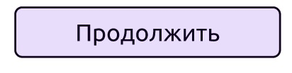
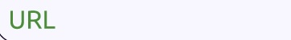

## Разработка интерактивного прототипа для сценария "Форма заказа дебетовой карты на сайте банка"

**ТЗ**

- Разработать не менее 5 экранных форм;
- Описать от 2 возможных сценариев;
- Сделать прототип кликабельным;
- Описать кликабельные части UI.

**Возможные сценарии**

- *Основной сценарий*:
   - Шаг 1: Пользователь нажимает на иконку “Дебетовая карта” на главном экране.
   - Шаг 2: Пользователь переходит на форму заказа дебетовой карты и нажимает кнопку “Заказать”.
   - Шаг 3: Система выводит уведомление об успешном заказе карты.
   - Шаг 4: Пользователь нажимает кнопку “ОК”.
   - Шаг 5: Система возвращает пользователя на главный экран.
     
- *Альтернативный сценарий*:
   - Шаг 1: Пользователь нажимает на иконку чата поддержки справа в нижнем углу на главном экране или любом другом экране, где есть эта иконка.
   - Шаг 2: Пользователь пишет сообщение боту, например, “Заказать дебетовую карту” и переходит по “URL” в ответном сообщении на форму заказа дебетовой карты.
   - Шаг 3: Пользователь нажимает кнопку “Заказать”.
   - Шаг 4: Система выводит сообщение об успешном заказе карты.
   - Шаг 5: Пользователь нажимает кнопку “ОК”.
   - Шаг 6: Система возвращает пользователя на главный экран.

- *Исключительный сценарий 1*:
   - Шаг 1: Пользователь нажимает на иконку “Дебетовая карта” на главном экране.
   - Шаг 2: Пользователь переходит на форму заказа дебетовой карты и нажимает кнопку “Заказать”.
   - Шаг 3: Система выводит пользователю уведомление об ошибке.
   - Шаг 4: Пользователь нажимает кнопку “ОК”.
   - Шаг 5: Система возвращает пользователя на главный экран.
 
- *Исключительный сценарий 2*:
   - Шаг 1: Пользователь нажимает на иконку чата поддержки справа в нижнем углу на главном экране или любом другом экране, где есть эта иконка.
   - Шаг 2: Пользователь пишет сообщение боту, например, “Заказать дебетовую карту”.
   - Шаг 3: Пользователь переходит по URL в ответном сообщении от бота на форму заказа дебетовой карты.
   - Шаг 4: Пользователь нажимает кнопку “Заказать”.
   - Шаг 5: Система выводит пользователю уведомление об ошибке.
   - Шаг 6: Пользователь нажимает кнопку “ОК”.
   - Шаг 7: Система возвращает пользователя на главный экран.

**Артефакты**

- Сценарий 1: "Пользователь зарегистрирован, выполняет вход и далее идет по основному сценарию заказа дебетовой карты или альтернативному сценарию заказа дебетовой карты":
   - Ссылка на артефакт: https://figma.fun/Qk6HdN

- Сценарий 2: "Пользователь зарегистрирован, выполняет вход и далее идет по исключительному сценарию заказа дебетовой карты 1 или исключительному сценарию заказа дебетовой карты 2":
   - Ссылка на артефакт: https://figma.fun/uZgljX
   
- Сценарий 3: "Пользователь не был зарегистрирован, проходит регистрацию и далее идет по основному сценарию заказа дебетовой карты или альтернативному сценарию заказа дебетовой карты":
   - Ссылка на артефакт: https://figma.fun/rs1O5S

- Сценарий 4: "Пользователь не был зарегистрирован, проходит регистрацию и далее идет по исключительному сценарию заказа дебетовой карты 1 или исключительному сценарию заказа дебетовой карты 2":
   - Ссылка на артефакт: https://figma.fun/Wv1UqS

**Описание UI**

|#|Элемент|Название элемента|Тип элемента|Параметр элемента|Логика работы|
|-|----------|----------|----------|----------|----------|
|1||Вход|Текст-ссылка|Динамичен|При нажатии открывается страница входа. Подсвечивается фиолетовым цветом, когда пользователь находится на странице входа.|
|2||Подтверждение входа|Кнопка|Активен|При нажатии открывается главная страница.|
|3||Нет логина и пароля|Текст-ссылка|Активен|При нажатии открывается первая страница регистрации в Сценариях 3 и 4.|
|4||Регистрация|Текст-ссылка|Динамичен|При нажатии открывается первая страница регистрации в Сценариях 3 и 4. Подсвечивается фиолетовым цветом, когда пользователь находится на странице регистрации.|
|5||Продолжение регистрации|Кнопка|Активен|При нажатии открывается вторая страница регистрации в Сценариях 3 и 4.|
|6||Завершение регистрации|Кнопка|Активен|При нажатии открывается главная страница в Сценариях 3 и 4.|
|7||Логотип|Кнопка|Активен|Кнопка направляет на главную страницу.|
|8||Название модуля|Текст-ссылка|Динамичен|При нажатии открывается главная страница. Подсвечивается фиолетовым цветом, когда пользователь находится на главной странице.|
|9||Выход|Кнопка|Активен|Кнопка направляет на страницу входа.|
|10||Дебетовая карта|Кнопка|Активен|Кнопка направляет на страницу с формой заказа дебетовой карты.|
|11||Чат|Иконка|Активен|Иконка направляет на страницу с чатом поддержки.|
|12||Отмена|Кнопка|Активен|Кнопка возвращает на главную страницу.|
|13||Заказ|Кнопка|Активен|При нажатии появляется модальное окно с успешным выполнением операции в Сценариях 1 и 3 и с ошибкой операции в Сценариях 2 и 4.|
|14||Модальное окно|Карточка|Активен|При нажатии на текст “ОК” карточка возвращает на главную страницу в Сценариях 2 и 4.|
|15||Модальное окно|Карточка|Активен|При нажатии на текст “ОК” карточка возвращает на главную страницу в Сценариях 1 и 3.|
|16||Подтверждение действия|Текст-ссылка|Активен|При нажатии текст-ссылка возвращает на главную страницу.|
|17||URL|Ссылка|Активен|При нажатии открывается страница с формой заказа дебетовой карты.|
  
**Стек**
- Figma
